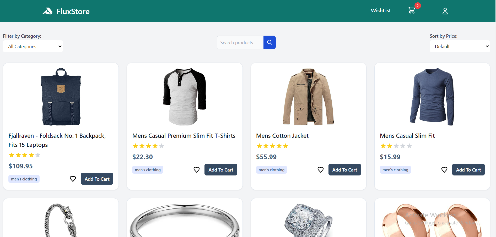
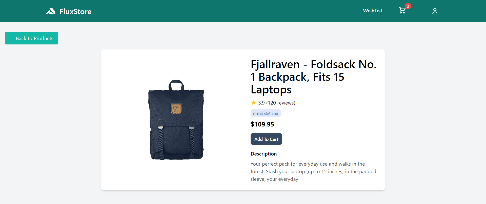

# FluxStore

FluxStore is a modern, responsive e-commerce application built with Svelte and styled using Tailwind CSS. This project demonstrates how to create a dynamic product catalog with features such as product listing, filtering, sorting, and detailed product views.




## Features

- Responsive grid layout for product display
- Product filtering by category
- Price-based sorting (ascending and descending)
- Detailed product view page
- Loading spinners for improved user experience
- State management using Svelte stores

## Technologies Used

- [Svelte](https://svelte.dev/) - A modern JavaScript framework for building user interfaces
- [Tailwind CSS](https://tailwindcss.com/) - A utility-first CSS framework for rapid UI development
- [Vite](https://vitejs.dev/) - Next generation frontend tooling

## Project Structure

```
FluxStore
├── node_modules/
├── public/
├── src/
│   ├── assets/
│   ├── components/
│   │   ├── Filter.svelte
│   │   ├── Header.svelte
│   │   ├── LoadingSpinner.svelte
│   │   ├── ProductCard.svelte
│   │   ├── ProductDetailSkeleton.svelte
│   │   ├── ProductGrid.svelte
│   │   ├── Search.svelte
│   │   └── Sort.svelte
│   ├── pages/
│   │   ├── Home.svelte
│   │   └── ProductDetail.svelte
│   ├── stores/
│   │   ├── filterSortStore.js
│   │   └── productStore.js
│   ├── App.svelte
│   └── main.js
├── .gitignore
├── index.html
├── package-lock.json
├── package.json
├── postcss.config.js
├── README.md
└── vite.config.js
```

## Setup Instructions

1. Clone the repository:

   ```
   git clone https://github.com/MohauMushi/Module_3_MOHMUS379_JSE2407_GroupA_Mohau-Mushi_JSF02.git

   ```

2. Navigate to the project Directory

   ```
   cd Module_3_MOHMUS379_JSE2407_GroupA_Mohau-Mushi_JSF02
   ```

3. Install dependencies:

   ```
   npm install
   ```

4. Start the development server:

   ```
   npm run dev
   ```

5. Open your browser and navigate to `http://localhost:3000` (or the port specified in your terminal)

## Usage

### Browsing Products

- The home page (Home.svelte) displays a grid of product cards.
- Each card shows the product image, title, price, and category.
- Click on a product card to view more details on the ProductDetail page.

### Filtering and Sorting

- Use the Filter component to filter products by category.
- Use the Sort component to sort products by price (ascending or descending).

### Searching Products

- Use the Search component to search for specific products.

### Loading States

- The LoadingSpinner component is used to display loading states while data is being fetched.

## State Management

- The `filterSortStore.js` manages the state for filtering and sorting operations.
- The `productStore.js` handles the product data and related operations.

## Contributing

Contributions are welcome! Please feel free to submit a Pull Request.
